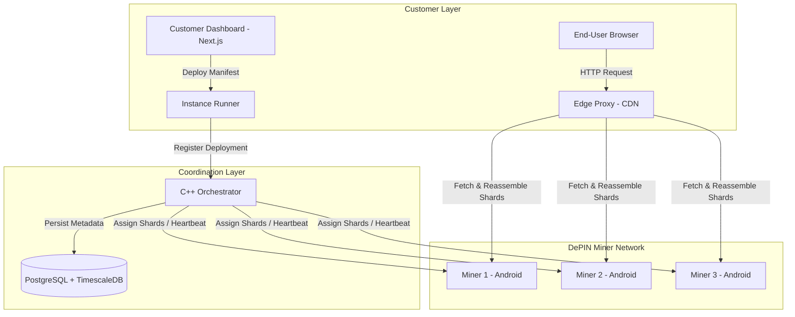

# Poot Architecture Guide

This document describes the structural design, data flow, networking, and security model of the Poot Decentralized Physical Infrastructure Network (DePIN).

---

## 1. System Topology Overview

Poot bridges resource-constrained mobile hardware with developers expecting professional-grade cloud infrastructure.



---

## 2. Core Components

### 2.1. Shard Engine (`packages/shard-engine/`)
The cryptographic core of the network, written in C++23 and compiled to native binaries or WASM (via Emscripten).
* **Erasure Coding**: Vandermonde Reed-Solomon GF(2^8) scheme. By default, splits files into $N=9$ shards consisting of $D=6$ data and $M=3$ parity shards. Any $D=6$ shards are sufficient to fully reconstruct the original asset.
* **Encryption**: AES-256-GCM. An encryption key is derived from the SHA-256 hash of the original data (ensuring content-addressable consistency).
* **Verification**: Merkle trees are constructed over the shards, generating root hashes stored in the orchestrator database for Proof-of-Storage checks.

### 2.2. Orchestrator (`services/orchestrator/`)
The primary system coordinator, implemented in C++23. It utilizes direct `libpq` connections to a PostgreSQL backend.
* **Miner Registry**: Maintains location, capacity, network state, battery, and uptime metrics.
* **Shard Router**: Assigns shards based on geodistribution, reliability scores, and storage capacities.
* **Uptime Daemon**: Monitors periodic heartbeats and automatically triggers re-replication if a miner goes offline.

### 2.3. Miner App (`apps/miner-app/`)
An Android-first React Native application designed for passive mobile resource contribution.
* **Resource Daemon**: Built using native Android WorkManager. Activates only when:
  * CPU utilization is under $40\%$
  * Connected to Wi-Fi (except for low-bandwidth heartbeats)
  * Device is charging or battery is above $30\%$
  * Thermal state is `nominal` or `fair`.
* **Resource Storage**: Stores encrypted shard blobs under safe sandbox folders.
* **Execution Sandbox**: (Phase 3) Lightweight WebAssembly (Wasmtime) sandbox to execute sandboxed tenant computations.

### 2.4. Edge Proxy / CDN (`services/edge-proxy/`)
A high-throughput server acting as the ingress point. It provides TLS termination, domain routing, and origin-shield pull-through caching.
* When a resource is requested, the Edge Proxy checks its high-performance local NVMe cache.
* On a cache miss, the Edge Proxy queries the Orchestrator for the shard assignments, fetches $D=6$ surviving shards from the miner network, reassembles and decrypts them, returns the asset to the client, and populates its local cache.

---

## 3. Database Schema

The database relies on PostgreSQL (with TimescaleDB for time-series heartbeats).

### 3.1. `miners` Table
Tracks status, physical characteristics, and current resource capacities:
```sql
CREATE TABLE miners (
  id                  TEXT PRIMARY KEY,
  wallet_address      TEXT NOT NULL DEFAULT '',
  country             TEXT NOT NULL DEFAULT '',
  region              TEXT NOT NULL DEFAULT '',
  latitude            DOUBLE PRECISION DEFAULT 0,
  longitude           DOUBLE PRECISION DEFAULT 0,
  storage_bytes_avail BIGINT NOT NULL DEFAULT 0,
  storage_bytes_used  BIGINT NOT NULL DEFAULT 0,
  compute_units_avail INTEGER NOT NULL DEFAULT 0,
  compute_units_used  INTEGER NOT NULL DEFAULT 0,
  status              TEXT NOT NULL DEFAULT 'offline',
  last_heartbeat      TIMESTAMPTZ NOT NULL DEFAULT now(),
  uptime_pct          INTEGER NOT NULL DEFAULT 0,
  reputation_score    INTEGER NOT NULL DEFAULT 100,
  is_charging         BOOLEAN NOT NULL DEFAULT false,
  battery_pct         INTEGER NOT NULL DEFAULT 0,
  cpu_pct             REAL NOT NULL DEFAULT 0,
  thermal_state       TEXT NOT NULL DEFAULT 'nominal',
  network_type        TEXT NOT NULL DEFAULT 'none'
);
```

### 3.2. `shard_assignments` Table
Maps which cryptographic shards reside on which mobile miners:
```sql
CREATE TABLE shard_assignments (
  id                 SERIAL PRIMARY KEY,
  shard_id           TEXT NOT NULL,
  miner_id           TEXT NOT NULL REFERENCES miners(id) ON DELETE CASCADE,
  customer_id        TEXT NOT NULL,
  replication_factor INTEGER NOT NULL DEFAULT 3,
  assigned_at        TIMESTAMPTZ NOT NULL DEFAULT now(),
  verified           BOOLEAN NOT NULL DEFAULT false
);
```

---

## 4. Key Architectural Upgrades

### 4.1. Native Mobile JSI Bridges (vs. WASM bridge)
To avoid JavaScript single-thread execution bottlenecks on mobile, the C++ Shard Engine will bypass traditional React Native bridges or WASM engines. It will utilize **React Native JSI (JavaScript Interface)** to bind native C++ pointers directly to JavaScript. This allows direct, high-performance execution of cryptographic encoding on the device’s bare-metal processor.

### 4.2. libp2p Connection Layer with NAT Traversal
Because mobile devices shift IP addresses frequently and sit behind carrier-grade NATs (CGNATs), traditional HTTP connections from the Orchestrator are unviable. We utilize **libp2p** to run secure, persistent streams between miners and the Orchestrator. The network leverages AutoNAT, STUN/TURN relays, and DCUtR (hole-punching) to guarantee message delivery under restrictive network constraints.
